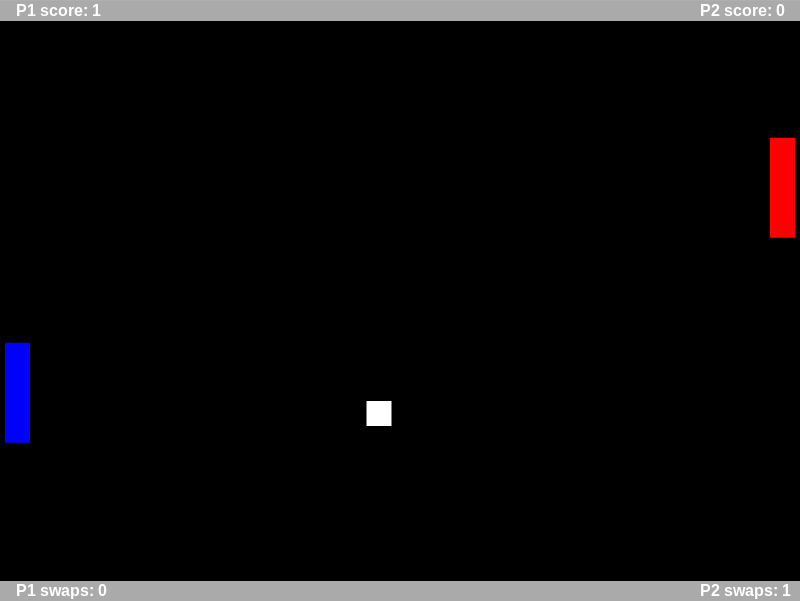

# Pongmoi

A simple pong clone **for two players on the same keyboard** with an extra addon: swapping! 

- Hit the ball 3 times in a row for get a swap. 
- Activate "swap" to swap positions with your oponent.
- First player to score 5 points wins.

## Play online!

[Play Pongmoi online](https://rawgit.com/moisesjbc/pongmoi/master/pongmoi.html)

## Downloading and playing Pongmoi locally

1. [Download this repository](https://github.com/moisesjbc/pongmoi/archive/master.zip) or clone it.
2. Enter into the directory and mount a simple server (ie. using Python) (\*).

        cd pongmoi
        python -m SimpleHTTPServer

3. Open an Internet browser a visit <localhost:8000>.
4. Enjoy!

(\*) While testing the game, I simply opened *pongmoi.html* with my Internet browser and it worked. However, [it is recommended to not do this](http://phaser.io/tutorials/getting-started) and mount a local server instead. 

## Credits

Game developed by Moisés J. Bonilla Caraballo ([spanish web](http://www.moisesjose.com), [Github](https://github.com/moisesjbc)) using [Phaser, the free HTML5 game framework](http://phaser.io/).

### Third party work

All the audio used in Pongmoi have been downloaded from <freesound.org> and they belong to their respective owners.

See [assets/LICENSE](assets/LICENSE) for more information.
